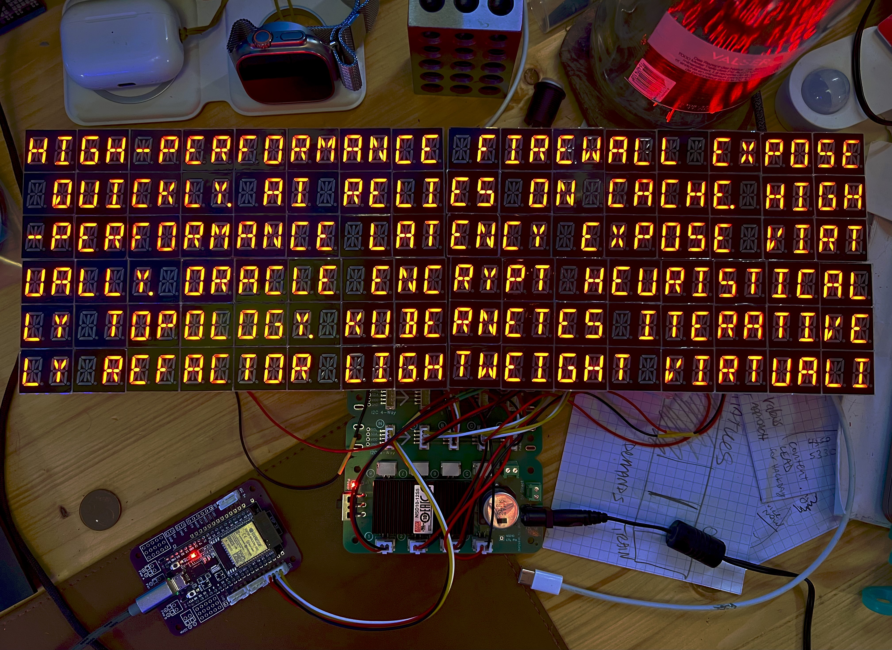
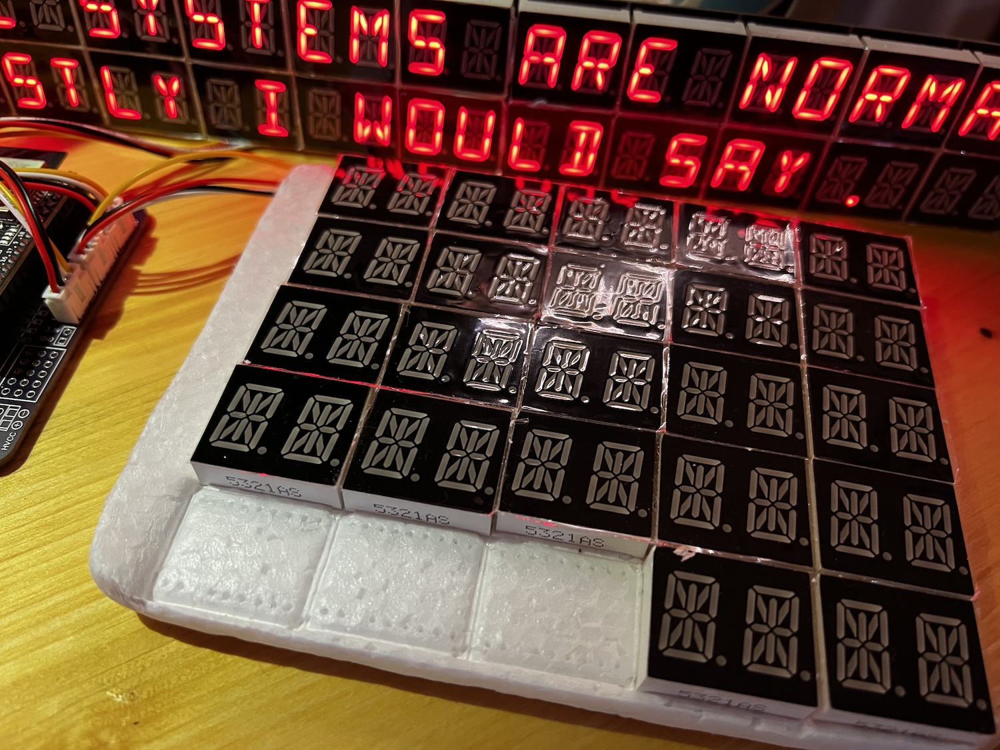
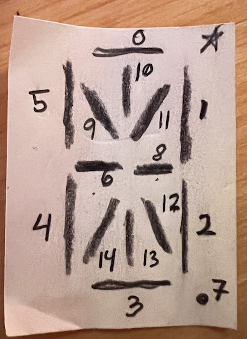
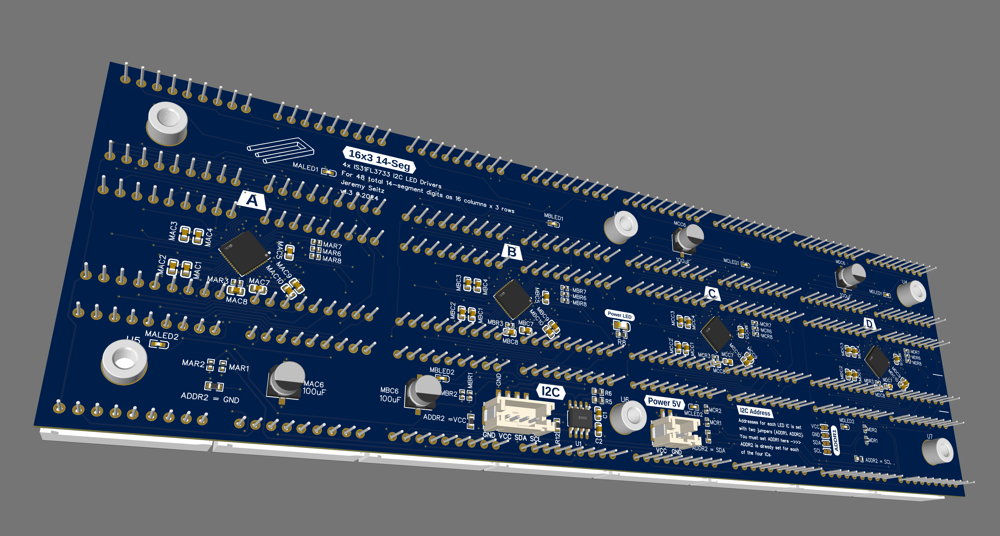
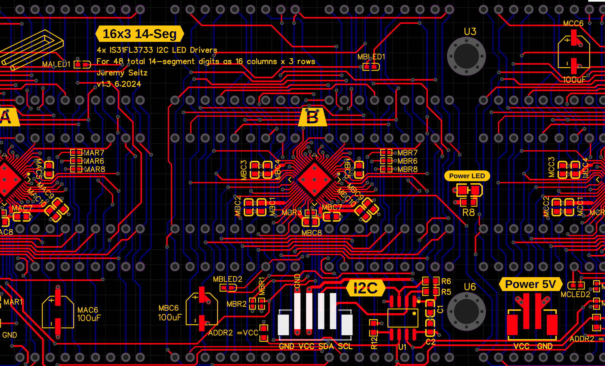
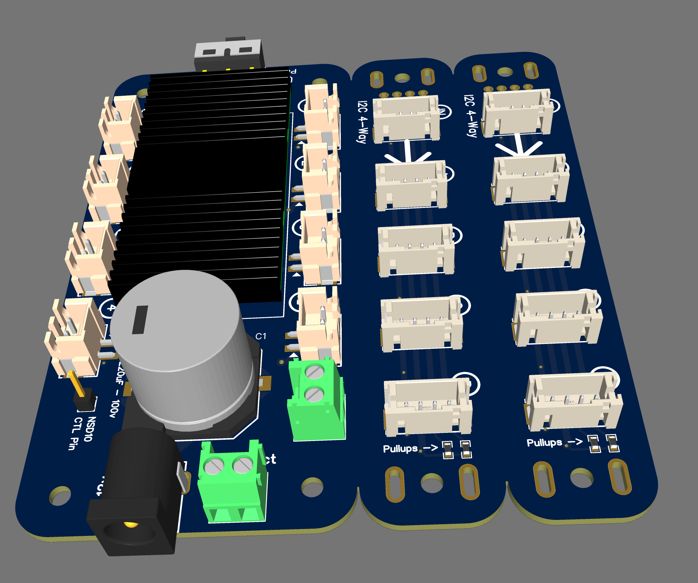
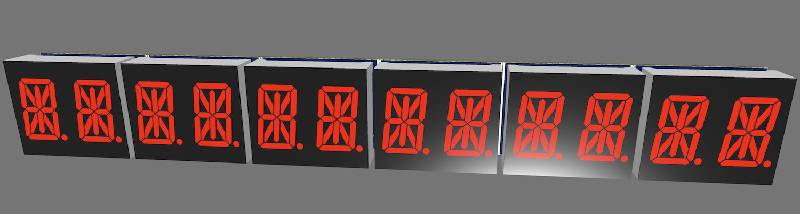
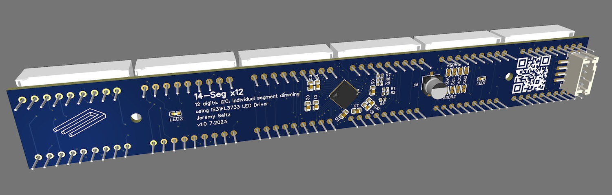
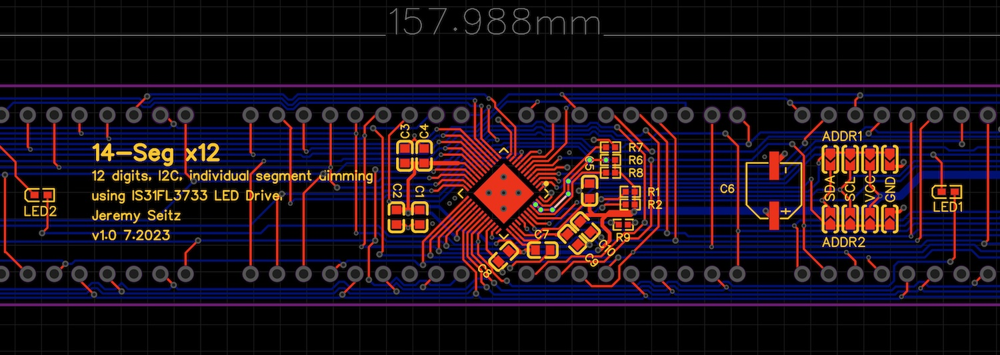
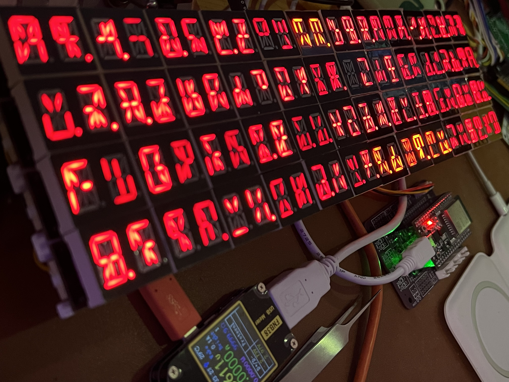

# 14-Segment Display Testing

This is test firmware for controlling a shitload of 14-segment LED modules:

Adafruit offers [a board that drives four digits](https://www.adafruit.com/product/1911), based on the HT16K33 LED driver chip, which is quite old and now discontinued. It also doesn't support a lot of addresses with I2C.

I wanted to drive a LOT more digits, and ended up using the more modern IS31FL3737 LED driver around a custom PCB. It supports individual segment dimming and many more I2C ddresses. 

I am using an ESP32 to develop this ongoing project with the eventual goal to build a massive 80x24 terminal using these LED modules (around 1 meter wide). 

There's no clear standard for how 14-segment digits
are wired. The LED driver supports 16 common cathode lines and 12 sinks.
This project is based around the 5321AS 0.54" 2-digit 14-seg module, which is usually available on AliExpress for less than $0.40 per component. It has 18 pins in total with decimal places.

In this application, the module pinouts are shown in the following sequence:

The PCB supports different I2C addresses, set with solder jumpers. So with a single I2C connection you can control 16x12 digits, or 192 characters. And they could be tiled by using multiple controllers or some kind of I2C multiplexing. 

## Build Updates

### Version 1.1

After building the rev1 prototype (see below), it was clear there were too many connection points for wires and screws to deal with. I re-designed the PCB to include four drivers, arranged in a 16 column x 3 line layout. I also added JST PH 2.0 connectors for I2C and power, with a TI level shifter/buffer to handle I2C. This prototype was working well. (July 2024)

And a special board to distribute power and I2C connections to 8x modules.

### Version 1.0

In the first rev, each PCB had 12 digits and a single LED driver. This worked, but was a bit of a pain to assemble. (January 2024)

