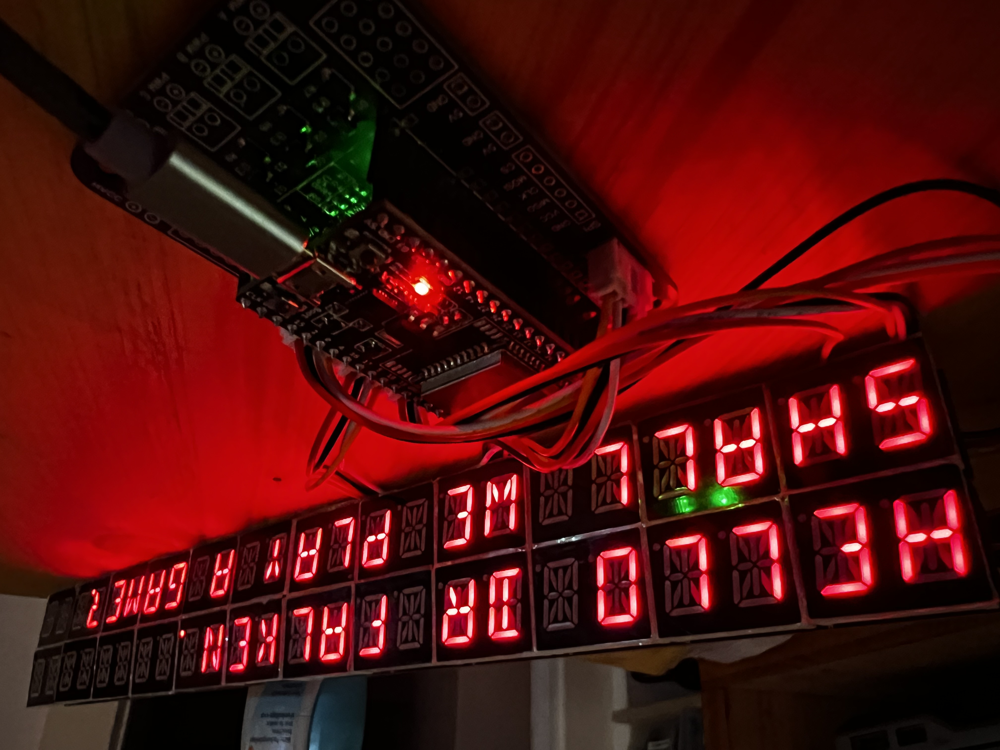

# 14-Segment Display Testing

Using the IS31FL3737 LED driver, and a custom PCB.
In this configuration there are 12 characters per board. 

Using I2C, there can be 16 boards. This allows for 
example a 48x4 line display sign.

The LED driver supports 16 common cathode lines.
There's no clear standard for how 16-segment digits
are wired. The 5321AS 0.8" 2-digit 
module was used for testing.

In this application, the first 14 lines are connected
in the following sequence:

The PCB supports up to 16 I2C addresses, set with solder jumpers.

